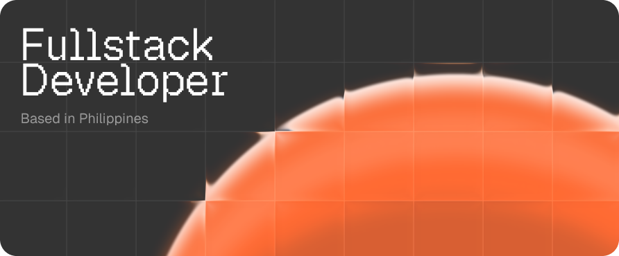

  

<table>
  <tr>
    <td width="33.5%" valign="top">
      
    </td>
    <td width="65.5%" valign="top">
      
    </td>
  </tr>
</table>

## ⚡ Tech Stack

### Frontend

  

  <svg xmlns="http://www.w3.org/2000/svg" width="256" height="256" fill="none"><path d="M 112 32 L 54.627 32 L 128 105.373 L 201.373 32 L 144 32 L 144 0 L 256 0 L 256 112 L 224 112 L 224 54.627 L 150.627 128 L 224 201.373 L 224 144 L 256 144 L 256 256 L 144 256 L 144 224 L 201.373 224 L 128 150.627 L 54.627 224 L 112 224 L 112 256 L 0 256 L 0 144 L 32 144 L 32 201.373 L 105.373 128 L 32 54.627 L 32 112 L 0 112 L 0 0 L 112 0 Z" fill="#FB4805"></path></svg>

### Backend

  

### Database & ORM

  

### Tools & DevOps

  

---
